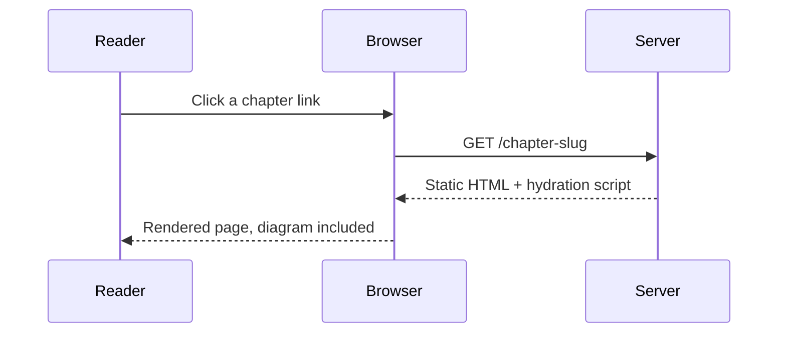

Every chapter in this template can use a set of rich components **without importing anything**.
They are injected automatically, so you write clean, semantic tags instead of raw HTML. This chapter
is a live reference — everything you see below is rendered by the same components you'll use.

## Callouts

Use `<Callout>` to draw attention. The `type` prop picks the colour and icon; `title` is optional.

<Callout type="info">
  Informational note. Great for context, links, and asides. Defaults to the "Note" title.
</Callout>

<Callout type="tip" title="Best Practice">
  Tips and recommendations. Pass a custom `title` when the default doesn't fit.
</Callout>

<Callout type="warning">
  Warnings about sharp edges, gotchas, or things that are easy to get wrong.
</Callout>

<Callout type="danger">
  Destructive or irreversible actions. Reserve this for genuine "you have been warned" moments.
</Callout>

## Steps

Wrap an ordinary numbered list in `<Steps>` to turn it into a guided sequence with badges and a rail.

<Steps>

1. Create a new chapter with `npm run new-chapter -- "My Chapter"`.
2. Fill in the frontmatter `description` and pick an `icon` from [lucide.dev](https://lucide.dev/icons).
3. Write your content using the components on this page.
4. Run `npm run build` — search indexing and the table of contents update automatically.

</Steps>

## Tabs

Perfect for showing the same task across package managers or languages. Keyboard accessible, and it
degrades to stacked panels if JavaScript is unavailable.

<Tabs>
  <Tab label="npm">
    ```bash
    npm install
    npm run dev
    ```
  </Tab>
  <Tab label="pnpm">
    ```bash
    pnpm install
    pnpm dev
    ```
  </Tab>
  <Tab label="yarn">
    ```bash
    yarn
    yarn dev
    ```
  </Tab>
</Tabs>

## Figures

`<Figure>` renders images with a caption and reserves space ahead of load (no layout shift). Pass a
`darkSrc` for a theme-specific variant, and `bordered` for screenshots that need separation from the page.

```mdx
<Figure
  src="/diagrams/architecture-light.svg"
  darkSrc="/diagrams/architecture-dark.svg"
  alt="Request flow from browser to edge to origin"
  caption="Figure 4.1 — How a request travels through the stack."
  width={800}
  height={450}
/>
```

## Inline elements

Press <Kbd>Ctrl</Kbd> <Kbd>K</Kbd> to open search. Inline keys use `<Kbd>`.

Mark features with badges: <Badge variant="new">New</Badge> <Badge variant="beta">Beta</Badge> <Badge variant="deprecated">Deprecated</Badge> <Badge>Default</Badge>.

## Code blocks

Fenced code is syntax-highlighted (Shiki, One Dark Pro) and gets a language label and a copy button
automatically — no component needed.

```ts
export function greet(name: string): string {
  return `Hello, ${name}!`;
}
```

## Diagrams

A normal fenced ` ```mermaid ` block renders as an SVG diagram client-side — no component needed. It
re-renders automatically when you switch theme, and degrades to a syntax-highlighted code block if
JavaScript is unavailable.



<Callout type="tip">
  Headings (`##` and `###`) automatically populate the "On this page" navigation and get hover anchor
  links for deep-linking — try hovering a heading above.
</Callout>

## Checkpoint

Before using these components in a book, confirm that the selected component communicates meaning, remains keyboard accessible, and renders correctly in both light and dark themes.
